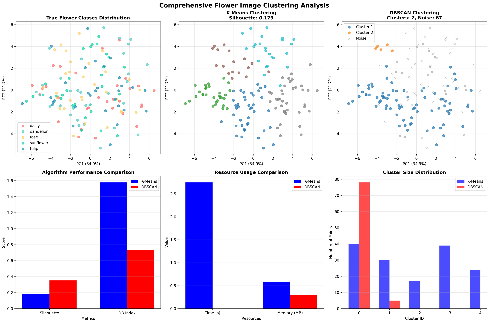

# Automatic Image Clustering using K-Means & DBSCAN

## Overview
This project implements an unsupervised image clustering system that groups unlabeled images based on visual similarity using two classical clustering algorithms: **K-Means** and **DBSCAN**.  
The purpose is to analyze clustering behavior, noise detection, scalability, execution time, and memory performance across both algorithms in a computer vision context.

---

## Dataset
The project uses the **Flowers Recognition** dataset (Kaggle), consisting of **4,313 images** from **5 flower species**:

- Daisy  
- Dandelion  
- Rose  
- Sunflower  
- Tulip  

The dataset is balanced enough for controlled experimentation and supports high-variance visual patterns.

---

## Algorithms Compared

### **1. K-Means (Centroid-based)**
- Assumes spherical clusters  
- Requires predefined number of clusters (k)  
- Sensitive to noise & outliers  
- Low memory usage and fast execution  

### **2. DBSCAN (Density-based)**
- Parameterized by ε (radius) + MinPts  
- Detects noise/outliers automatically  
- Can form arbitrary shaped clusters  
- No need to specify the number of clusters  

---

## Feature Extraction
Images were converted into feature vectors using:
- Color histograms  
- Dimensionality reduction  

This enables clustering in a lower-dimensional feature space.

---

## Evaluation Metrics
Clustering performance was evaluated using:

- **Silhouette Score**
- **Davies–Bouldin Index (DBI)**
- **Execution Time**
- **Memory Usage**
- **Noise Detection** *(DBSCAN only)*

---

## Experimental Results

| Metric | K-Means | DBSCAN |
|--------|--------|--------|
| Speed | Faster | Slower |
| Memory Usage | Lower | Higher |
| Noise Handling | Poor | Excellent |
| Data Assumptions | Spherical clusters | Arbitrary shapes |
| Requires K? | Yes | No |
| Outliers | Not detected | Automatically labeled |

---

## Key Findings
- **K-Means** achieved consistent clustering performance with lower computational cost, making it suitable for large datasets.
- **DBSCAN** produced more semantically meaningful clusters by identifying noise and irregular shapes, outperforming K-Means in structure-sensitive cases.
- DBSCAN is advantageous when dataset boundaries are unclear or non-linear, but requires fine-tuning of **ε** and **MinPts**.

---

## Visualization
The project includes visualization of resulting clusters and noise points for qualitative analysis.

Example outputs:
- Clustered image groups  
- Noise/outlier detection *(DBSCAN)*  
- Metric plots *(Silhouette & DBI)*  
- Resource usage & cluster size distribution  

  

---

## Technologies Used
- Python 3.x  
- NumPy  
- Scikit-Learn  
- OpenCV  
- Matplotlib  
- Jupyter Notebook  

